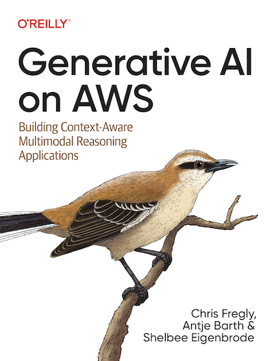

# 第四章：内存和计算优化

# 问题与解答
_问：生成式人工智能模型中的主要内存挑战是什么？_

答：生成式人工智能模型（尤其是具有数十亿参数的模型）中的主要内存挑战包括达到 GPU RAM 的限制。

_问：量化在优化模型中起什么作用？_

答：量化通过减少加载和训练模型所需的内存，在优化模型中起着至关重要的作用。它涉及将模型参数从较高精度（如 32 位）转换为较低精度（如 16 位或 8 位），从而减少内存使用并提高训练性能和成本效益。

_问：你能解释一下 FlashAttention 和分组查询注意力吗？_

答：FlashAttention 旨在减少基于 Transformer 的模型中自注意力层的二次计算和内存需求，通过减少内存读写量来提高性能。分组查询注意力 (GQA) 改进了传统的多头注意力机制，它为每组查询头共享一个键和值头，从而减少内存消耗并提高性能，这对于较长的输入序列特别有利。

_问：分布式计算在生成式人工智能中的优势是什么？_

答：分布式计算为训练大型生成式人工智能模型提供了显著优势。它允许跨多个 GPU 训练大型模型，从而提高 GPU 利用率和成本效益。分布式数据并行 (DDP) 和完全分片数据并行 (FSDP) 等分布式计算模式通过跨多个 GPU 有效管理内存和计算资源，促进了大型模型的训练。

_问：分布式数据并行和完全分片数据并行有何不同？_

答：分布式数据并行 (DDP) 涉及将整个模型复制到每个 GPU 上并并行处理数据，这适用于单个 GPU 可以容纳整个模型的情况。完全分片数据并行 (FSDP) 受 ZeRO 的启发，将模型分片到多个 GPU 上，从而减少每个 GPU 的内存需求。它会动态地重建层以进行计算，这使其适用于单个 GPU 无法容纳的模型。

_问：内存和计算优化如何影响模型的可扩展性和效率？_

答：内存和计算优化极大地提高了模型的可扩展性和效率。量化等技术降低了内存需求，从而允许在现有硬件上训练更大的模型。DDP 和 FSDP 等分布式计算方法支持跨多个 GPU 对大型模型进行高效训练，从而提高可扩展性和整体资源利用率。

# 章节
* [第一章](/01_intro) - 生成式人工智能用例、基础知识、项目生命周期
* [第二章](/02_prompt) - 提示工程和上下文学习
* [第三章](/03_foundation) - 大型语言基础模型
* [第四章](/04_optimize) - 量化和分布式计算
* [第五章](/05_finetune) - 微调和评估
* [第六章](/06_peft) - 参数高效微调 (PEFT)
* [第七章](/07_rlhf) - 使用带有 RLHF 的强化学习进行微调
* [第八章](/08_deploy) - 优化和部署生成式人工智能应用程序
* [第九章](/09_rag) - 检索增强生成 (RAG) 和代理
* [第十章](/10_multimodal) - 多模态基础模型
* [第十一章](/11_diffusers) - 使用 Stable Diffusion 进行受控生成和微调
* [第十二章](/12_bedrock) - 用于生成式人工智能的 Amazon Bedrock 托管服务

# 相关资源
* YouTube 频道：https://youtube.generativeaionaws.com
* 生成式人工智能 AWS Meetup（全球，虚拟）：https://meetup.generativeaionaws.com
* AWS 上的生成式人工智能 O'Reilly 图书：https://www.amazon.com/Generative-AI-AWS-Multimodal-Applications/dp/1098159225/
* AWS 上的数据科学 O'Reilly 图书：https://www.amazon.com/Data-Science-AWS-End-End/dp/1492079391/
