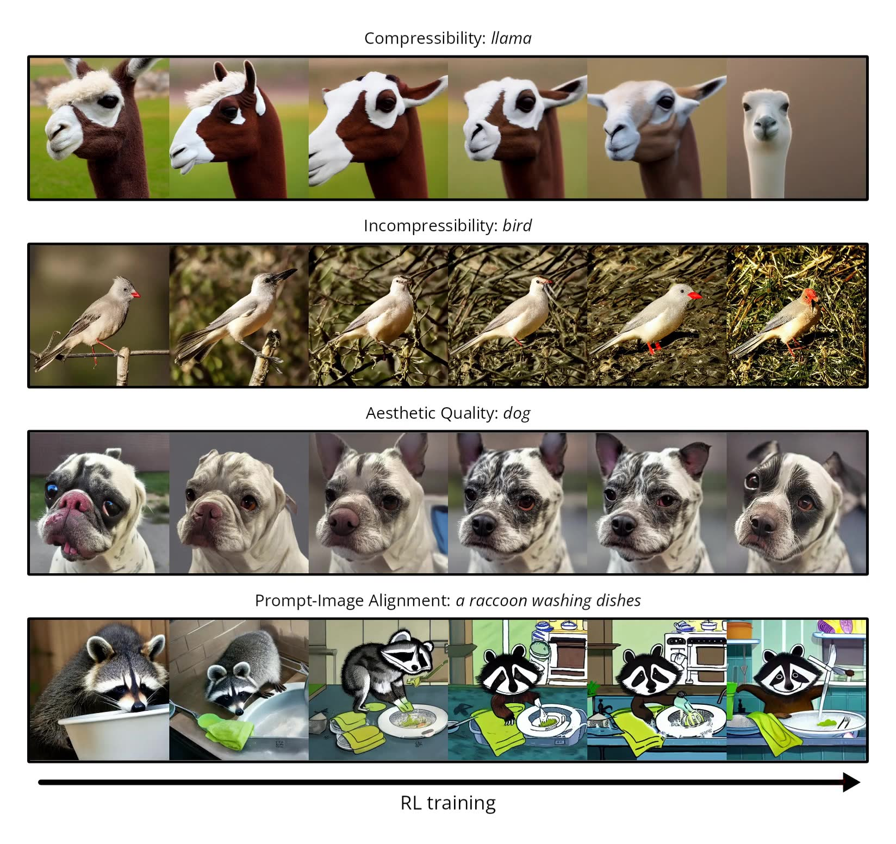

# ddpo-pytorch

这是一个使用 PyTorch 实现的 [去噪扩散策略优化 (DDPO)](https://rl-diffusion.github.io/)，支持 [低秩自适应 (LoRA)](https://huggingface.co/docs/diffusers/training/lora)。与我们最初的研究代码（你可以在 [这里](https://github.com/jannerm/ddpo) 找到）不同，这个实现是在 GPU 上运行的，如果启用了 LoRA，则需要不到 10GB 的 GPU 内存来微调 Stable Diffusion！



## 安装

需要 Python 3.10 或更高版本。

```bash
git clone git@github.com:kvablack/ddpo-pytorch.git
cd ddpo-pytorch
pip install -e .
```

## 使用

```bash
accelerate launch scripts/train.py
```

这将立即开始使用 `config/base.py` 中的配置，在所有可用的 GPU 上对 Stable Diffusion v1.5 进行可压缩性微调。只要每个 GPU 至少有 10GB 的内存，它应该可以正常工作。如果你不想登录到 wandb，你可以在执行上述命令之前运行 `wandb disabled`。

请注意，`config/base.py` 中的默认超参数并非旨在获得良好的性能，它们只是为了让代码尽快运行起来。我预计在不使用每个 epoch 更多的样本数量和梯度累积步骤的情况下，不会获得良好的结果。

## 重要的超参数

可以在 `config/base.py` 中找到所有超参数的详细解释。这里列出了一些重要的超参数。

### prompt_fn 和 reward_fn

从高层次上看，微调扩散模型的问题由两件事定义：一组用于生成图像的提示，以及一个用于评估这些图像的奖励函数。提示由 `prompt_fn` 定义，该函数不接受任何参数，并在每次调用时生成一个随机提示。奖励函数由 `reward_fn` 定义，该函数接受一批图像，并返回这些图像的一批奖励。当前实现的所有提示和奖励函数分别可以在 `ddpo_pytorch/prompts.py` 和 `ddpo_pytorch/rewards.py` 中找到。

### 批量大小和累积步骤

每个 DDPO epoch 包含生成一批图像、计算它们的奖励，然后对这些图像进行一些训练步骤。一个重要的超参数是每个 epoch 生成的图像数量；你希望有足够的图像来获得平均奖励和策略梯度的良好估计。另一个重要的超参数是每个 epoch 的训练步骤数量。

但是，这些不是明确定义的，而是由几个其他超参数隐式定义的。首先要注意，所有批量大小都是 **每个 GPU** 的。因此，每个 epoch 生成的图像总数为 `sample.batch_size * num_gpus * sample.num_batches_per_epoch`。有效的总训练批量大小（如果你包含多 GPU 训练和梯度累积）为 `train.batch_size * num_gpus * train.gradient_accumulation_steps`。每个 epoch 的训练步骤数量是第一个数字除以第二个数字，即 `(sample.batch_size * sample.num_batches_per_epoch) / (train.batch_size * train.gradient_accumulation_steps)`。

（这假设 `train.num_inner_epochs == 1`。如果将其设置为更高的数字，则训练将在生成新批图像之前多次循环遍历同一批图像，并且每个 epoch 的训练步骤数量将相应地乘以。）

在每次训练运行的开始，脚本将打印出计算出的每个 epoch 生成的图像数量、有效的总训练批量大小和每个 epoch 的训练步骤数量的值。请务必仔细检查这些数字！

## 复制结果

README 顶部的图像使用 LoRA 生成的！但是，我确实使用了一台相当强大的 DGX 机器，配备 8 个 A100 GPU，每个实验需要大约 4 个小时才能完成 100 个 epoch。为了使用单个小型 GPU 运行相同的实验，你需要将 `sample.batch_size = train.batch_size = 1`，并相应地乘以 `sample.num_batches_per_epoch` 和 `train.gradient_accumulation_steps`。

你可以在 `config/dgx.py` 中找到我用于 4 个实验的精确配置。例如，要运行美学质量实验：

```bash
accelerate launch scripts/train.py --config config/dgx.py:aesthetic
```

如果你想运行 LLaVA 提示-图像对齐实验，你需要使用 [这个仓库](https://github.com/kvablack/LLaVA-server/) 将几个 GPU 专用于运行 LLaVA 推理。

## 奖励曲线


如美学实验所示，如果你运行时间足够长，算法最终会遇到不稳定性。这可以通过衰减学习率来解决。有趣的是，然而，在不稳定性之后获得的实际定性样本大多很好——平均值的下降是由一些得分低的异常值造成的。从完整的奖励直方图可以清楚地看出这一点，如果你在 wandb 中查看单个运行，就可以看到它。


